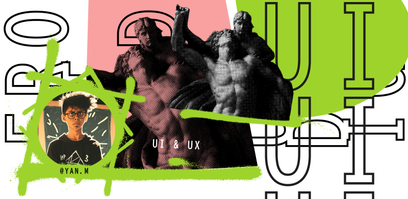

# <b>[Yan M. 🡽](https://www.instagram.com/yan.mantovani/)</b>
### <b>Hey, what's up?</b>
   

## <b>Sobre mim</b>
### Front-end - Conhecimentos: 
React | JavaScript | Html 5 | Css 3 | Sass | Bootstrap 5
### Ferramentas:
Git | Github | VSCode

### UI Design - Conhecimentos: 
Tipografia | Teoria das cores | Grids | Componentes e Variantes. 
Wireframe: Baixa fidelidade e Alta fidelidade. 
Prototipação: Baixa fidelidade e Alta fidelidade | Protótipos interativos. 
Styleguide: Tipografia | Estados dos componentes | Paleta de cores | Grids | Tokens
### Ferramentas:
Figma 

<b>

  _The ambition to achieve can take you to places you never imagined._

</b>
   

## <b>Contate-me</b>

   &nbsp;
   &nbsp;
   &nbsp;

   
